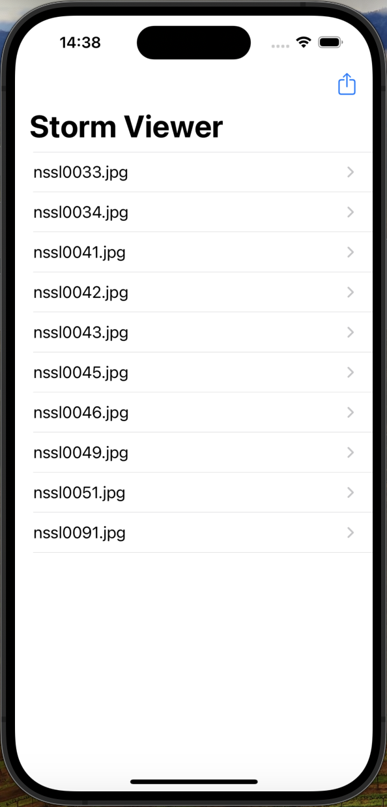
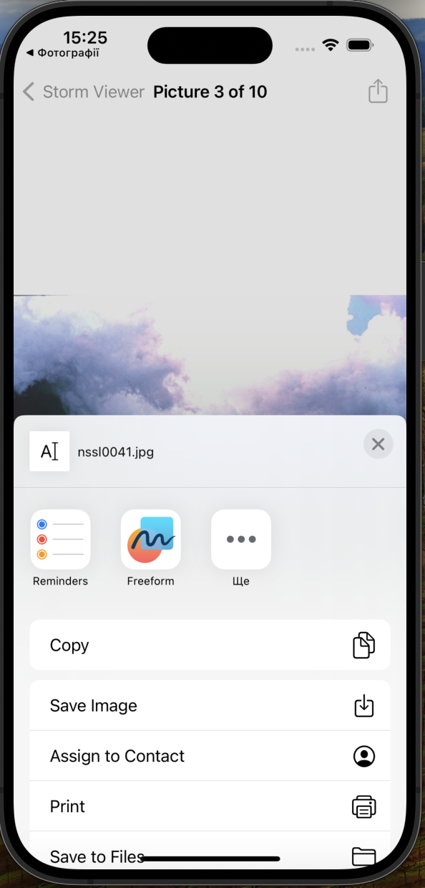

# Project3

Project3 is a simple photo viewer app that allows users to view and share images.

## Table of Contents

* [Features](#features)
* [Screenshots](#screenshots)
* [Requirements](#requirements)
* [Usage](#usage)
* [Code Overview](#code-overview)

## Features

* Displays a list of pictures
* Allows users to view the details of each picture
* Includes a share feature to share individual pictures

## Screenshots

  
   
  <em>Storm Viewer Screen</em>

  
   
  <em>Save Picture Screen</em>

## Requirements

* iOS 12.0+
* Xcode 12.0+
* Swift 5.0+

## Usage

1. Launch the app.
2. View the list of pictures.
3. Tap on a picture to view its details.
4. Share the picture with others.

## Code Overview

### ViewController

* Manages the list of pictures and displays them in a table view.
* Handles user interactions, such as selecting a picture to view its details.

### DetailViewController

* Displays the details of a selected picture, including its image and title.
* Includes a share feature to share the selected picture.
* Allows users to hide the navigation bar on tap.
